# Byterover Skills

A collection of specialized Claude Code skills for enhanced knowledge management with [Byterover MCP Server](https://www.byterover.dev/).

## Overview

### What is Byterover?

Byterover is an AI memory system that enables persistent knowledge storage and retrieval across conversations. It allows AI agents to:

- Store programming facts, patterns, and solutions
- Retrieve relevant context from past conversations
- Build cumulative knowledge over time
- Share knowledge across different projects


### What are Byterover Skills?

Skills extend Byterover's core capabilities with specialized workflows:

- **Structured documentation generation** (reports, PRDs, architecture docs)
- **Bidirectional integrations** (Notion, GitHub, etc.)
- **Advanced knowledge synthesis** (aggregation, formatting, analysis)
- **Automated workflows** for common knowledge management tasks

```mermaid
graph TB
    A[Byterover Core] --> B[byterover-notion-sync]
    A --> C[Future Skills]
    B --> D[Memories ↔️ Notion]
    C --> E[Meetings, GitHub, Code]
```



---

## Installation

### Prerequisites

1. **Claude Code** - Install from [claude.ai/claude-code](https://claude.ai/claude-code)
2. **Byterover MCP Server** - Set up from [byterover.dev](https://www.byterover.dev/)
3. **Notion MCP Server** (optional) - Required for byterover-notion-sync ([setup guide](https://developers.notion.com/docs/mcp))

### Installing Skills

Clone and copy skills to your Claude Code directory:

```bash
# Clone repository
git clone https://github.com/RyanNg1403/byterover-skills.git
cd byterover-skills

# Copy individual skill
cp -r byterover-notion-sync ~/.claude/skills/

# Or copy all skills
cp -r */ ~/.claude/skills/
```

### Verify Installation

Start Claude Code and ask: "What Byterover skills are available?"

---

## Skills

### 🔄 byterover-notion-sync

Bidirectional knowledge synchronization between Byterover memories and Notion documentation.

**Core Capabilities:**

- Transform memories → Notion documentation (4 formats: implementation reports, PRDs, feature docs, architecture docs)
- Import Notion pages → searchable memories with intelligent chunking
- Multi-query retrieval for comprehensive context
- Automatic format selection based on content

**Architecture:**

```mermaid
graph TB
    subgraph "Memories → Notion"
        A[Byterover Memories] -->|Multi-query| B[Aggregate Context]
        B -->|Format Selection| C{Document Type}
        C -->|Timeline-based| D[Implementation Report]
        C -->|Requirements| E[PRD]
        C -->|Usage Guide| F[Feature Docs]
        C -->|System Design| G[Architecture Docs]
        D --> H[Notion Page]
        E --> H
        F --> H
        G --> H
    end

    subgraph "Notion → Memories"
        I[Notion Page] -->|Fetch| J[Analyze Structure]
        J -->|Chunk| K[Logical Sections]
        K -->|Format| L[Memory Templates]
        L -->|Store| M[Byterover Memories]
    end
```



**Example Use Cases:**

```
"Create an implementation report on the auth system from July 10-15"
"Turn our notification discussions into a PRD"
"Document the microservices architecture"
"Import API documentation from Notion into memories"
```

**Documentation:**

- [SKILL.md](byterover-notion-sync/SKILL.md) - Complete workflow guides
- [references/](byterover-notion-sync/references/) - Format templates and guidelines

**Workflow Overview:**

```mermaid
sequenceDiagram
    participant U as User
    participant C as Claude
    participant B as Byterover
    participant N as Notion

    Note over U,N: Memories → Notion
    U->>C: "Create implementation report"
    C->>B: Multi-query memories
    B-->>C: Aggregate results
    C->>C: Select format & structure
    C->>N: Create Notion page
    N-->>U: Return page link

    Note over U,N: Notion → Memories
    U->>C: "Import Notion page"
    C->>N: Fetch page content
    N-->>C: Return structured content
    C->>C: Chunk & format
    C->>B: Store memories
    B-->>U: Confirm storage
```



---

## Usage

Skills activate automatically based on your requests - no special commands needed.

**Example Workflows:**

```
# Generate documentation from memories
User: "Create an implementation report on the payment system we built last week"
→ Queries memories → Structures as report → Creates Notion page with timeline

# Import documentation into memories
User: "Import our API documentation from Notion into memories"
→ Fetches Notion page → Breaks into chunks → Stores as searchable memories

# Architecture documentation
User: "Document our microservices architecture based on recent work"
→ Retrieves architecture memories → Structures with diagrams → Creates Notion doc
```

---

## Contributing

### Adding New Skills

1. Fork this repository
2. Create skill following this structure:
   ```
   your-skill-name/
   ├── SKILL.md          # Required: Workflow instructions
   ├── references/       # Optional: Templates and guides
   ├── scripts/          # Optional: Executable helpers
   └── assets/           # Optional: Resources
   ```
3. Update this README with skill description
4. Submit pull request

See [CONTRIBUTING.md](CONTRIBUTING.md) for detailed guidelines.

---

## Roadmap

**Planned Skills:**

- **byterover-github-integration** - Sync PR discussions, code comments, and issues with memories
- **byterover-meeting-notes** - Convert transcripts into structured memories and action items
- **byterover-code-knowledge** - Extract code patterns, architectural decisions, and best practices
- **byterover-research-synthesis** - Aggregate memories into research reports and literature reviews

Have a skill idea? [Open an issue](https://github.com/RyanNg1403/byterover-skills/issues) or contribute!

---

## License

MIT License - see [LICENSE](LICENSE) for details.

## Acknowledgments

- Built for [Claude Code](https://www.claude.com/product/claude-code) by Anthropic
- Powered by [Byterover MCP Server](https://www.byterover.dev/)
- Integrations with [Notion MCP](https://developers.notion.com/docs/mcp)
