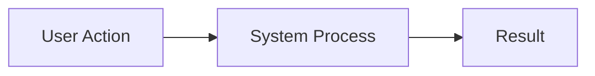

# Feature Documentation Format

**Purpose**: Convert Byterover memories into comprehensive user-facing feature documentation.

## Structure

### 1. Overview
```markdown
# [Feature Name]

**Status**: [Beta/Stable/Deprecated]
**Last Updated**: [Date]

## What is [Feature Name]?
[2-3 sentence introduction explaining what the feature does and its value]

## Key Benefits
- **[Benefit 1]**: [Description]
- **[Benefit 2]**: [Description]
- **[Benefit 3]**: [Description]

## Quick Start
[1-2 sentence description of simplest way to use the feature]

```quick-start-example
[Minimal code or steps to get started]
```
```

### 2. Use Cases
```markdown
## Common Use Cases

### Use Case 1: [Name]
**Scenario**: [When/why to use this]

**Example**:
[Concrete example from memories or generated]

**Result**: [What the user achieves]

---

### Use Case 2: [Name]
**Scenario**: [When/why to use this]

**Example**:
[Concrete example]

**Result**: [What the user achieves]

---

### Use Case 3: [Name]
[Repeat structure]
```

### 3. How It Works
```markdown
## How It Works

### Overview
[Plain language explanation of the feature's mechanism]

### Step-by-Step Flow
1. **[Step 1 Name]**: [What happens]
2. **[Step 2 Name]**: [What happens]
3. **[Step 3 Name]**: [What happens]

### Visual Diagram
[If available in memories, include architecture/flow diagram]


```

### 4. Using the Feature
```markdown
## Using [Feature Name]

### Basic Usage

#### Setup
1. [Setup step 1]
2. [Setup step 2]

#### Example
```language
[Code example from memories or generated]
```

**Explanation**:
- [Line/part 1]: [What it does]
- [Line/part 2]: [What it does]

### Advanced Usage

#### Customization Options
- **[Option 1]**: [Description and when to use]
- **[Option 2]**: [Description and when to use]

#### Advanced Example
```language
[More complex example]
```

**Key Features**:
- [Feature 1 used in example]
- [Feature 2 used in example]

### Configuration

#### Available Options
| Option | Type | Default | Description |
|--------|------|---------|-------------|
| [option1] | [type] | [default] | [description] |
| [option2] | [type] | [default] | [description] |

#### Configuration Example
```language
[Configuration code example]
```
```

### 5. Best Practices
```markdown
## Best Practices

### Do's ✅
- **[Practice 1]**: [Why this is recommended]
- **[Practice 2]**: [Why this is recommended]
- **[Practice 3]**: [Why this is recommended]

### Don'ts ❌
- **[Anti-pattern 1]**: [Why to avoid and what to do instead]
- **[Anti-pattern 2]**: [Why to avoid and what to do instead]

### Performance Tips
- [Tip 1 for optimal performance]
- [Tip 2 for optimal performance]

### Security Considerations
- [Security consideration 1]
- [Security consideration 2]
```

### 6. Troubleshooting
```markdown
## Troubleshooting

### Common Issues

#### Issue: [Problem Description]
**Symptoms**: [What the user sees]

**Cause**: [Why this happens]

**Solution**:
1. [Step 1 to resolve]
2. [Step 2 to resolve]

**Example**:
```language
[Code showing the fix]
```

---

#### Issue: [Problem Description]
[Repeat structure]

---

### Error Messages

#### `[Error Message]`
**Meaning**: [What this error indicates]

**Resolution**: [How to fix it]

---

### FAQ

**Q: [Common question]?**
A: [Answer with explanation]

**Q: [Common question]?**
A: [Answer with explanation]
```

### 7. Reference
```markdown
## API Reference

### Methods

#### `[methodName]()`
[Description of what it does]

**Parameters**:
- `[param1]` ([type]): [Description]
- `[param2]` ([type], optional): [Description]

**Returns**: ([type]) [Description]

**Example**:
```language
[Usage example]
```

---

#### `[methodName2]()`
[Repeat structure]

---

### Events

#### `[eventName]`
[When this event is triggered]

**Payload**:
```language
{
  [payload structure]
}
```

**Example**:
```language
[Event handling example]
```

## Related Features
- <mention-page url="...">Related Feature 1</mention-page>
- <mention-page url="...">Related Feature 2</mention-page>

## Additional Resources
- [External documentation link]
- [Tutorial link]
- [Blog post link]
```

## Memory Extraction Guidelines

When creating feature documentation from memories:

1. **Identify core functionality** from implementation and discussion memories
2. **Extract use cases** from user stories and problem-solving memories
3. **Find code examples** from implementation memories
4. **Gather troubleshooting info** from debugging and error-resolution memories
5. **Collect best practices** from optimization and lessons-learned memories
6. **Extract API details** from technical specification memories
7. **Find common issues** from support and bug-fix memories

## Documentation Style

- **Clarity**: Use simple language, avoid jargon
- **Examples**: Include practical, runnable examples
- **Structure**: Organize from simple to complex
- **Visuals**: Add diagrams where helpful (from memories or created)
- **Links**: Reference related documentation
- **Updates**: Note version-specific information

## Example Property Schema (if creating in database)

```javascript
{
  "Title": "Real-time Sync Feature",
  "Type": "Feature Documentation",
  "Status": "Published",
  "Feature Status": "Stable",
  "Category": "Core Features",
  "Tags": ["sync", "real-time", "collaboration"],
  "Last Updated": "2025-10-22",
  "Owner": ["tech-writer-id"],
  "Target Audience": "Developers"
}
```

## Tips for Quality Documentation

1. **User-focused**: Write for your audience (developers, end-users, admins)
2. **Example-driven**: Show, don't just tell
3. **Complete**: Cover happy path and edge cases
4. **Maintained**: Keep updated with feature changes
5. **Searchable**: Use clear headings and keywords
6. **Actionable**: Include clear steps and examples
7. **Referenced**: Link to related docs and resources
