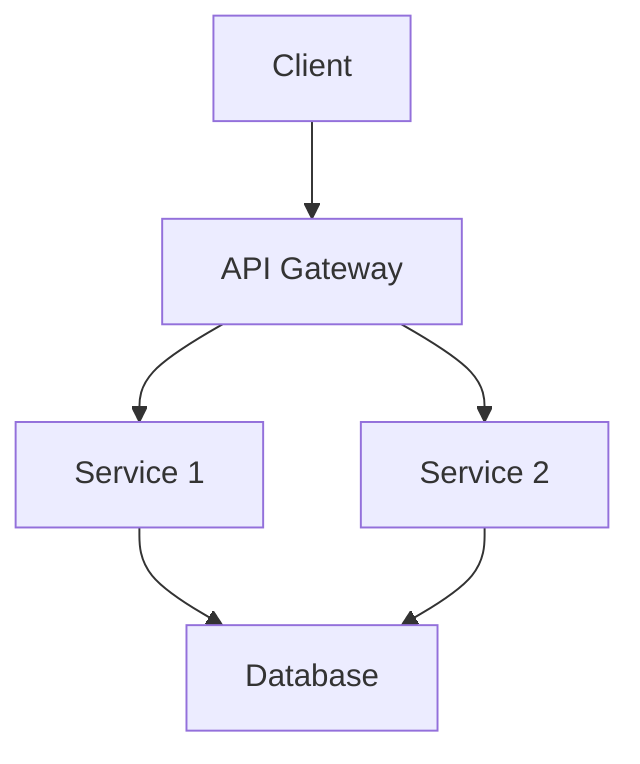
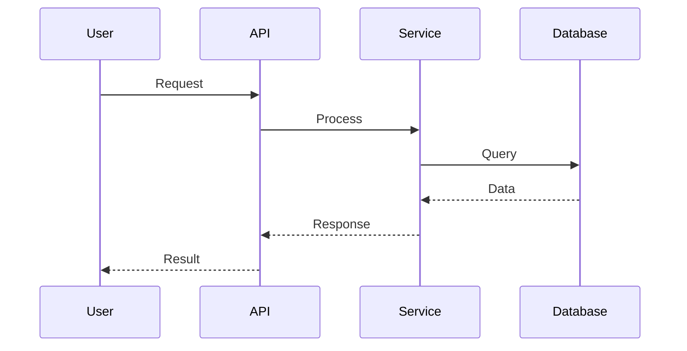

# Technical Architecture Documentation Format

**Purpose**: Convert Byterover memories about system design, architecture decisions, and technical implementations into comprehensive architecture documentation.

## Structure

### 1. Overview
```markdown
# [System/Component Name] - Architecture Documentation

**Version**: [1.0]
**Last Updated**: [Date]
**Owners**: [Team/People]
**Status**: [Current/Proposed/Deprecated]

## Executive Summary
[2-3 sentences describing the system at a high level]

## Purpose & Scope
**What this system does**: [Core functionality]

**What this system does NOT do**: [Explicit out-of-scope items]

**Target users/consumers**: [Who uses this system]
```

### 2. Context & Requirements
```markdown
## Business Context

### Problem Statement
[The problem this architecture solves]

### Business Goals
- [Goal 1]
- [Goal 2]
- [Goal 3]

### Key Requirements
- **Functional**: [Core functional requirements]
- **Performance**: [Performance requirements with metrics]
- **Scalability**: [Scalability requirements]
- **Reliability**: [Uptime, SLA requirements]
- **Security**: [Security requirements]
- **Compliance**: [Regulatory or compliance needs]

## Constraints & Assumptions

### Technical Constraints
- [Constraint 1: e.g., must use existing infrastructure]
- [Constraint 2: e.g., must integrate with legacy system]

### Business Constraints
- [Constraint 1: e.g., launch deadline]
- [Constraint 2: e.g., budget limitations]

### Assumptions
- [Assumption 1: e.g., traffic patterns]
- [Assumption 2: e.g., data volume growth]
```

### 3. System Architecture
```markdown
## High-Level Architecture

### System Overview
[Narrative description of the overall system architecture]

### Architecture Diagram

[Or reference diagram image if available]

### Key Architectural Patterns
- **[Pattern 1]** (e.g., Microservices): [Why this pattern was chosen]
- **[Pattern 2]** (e.g., Event-Driven): [Why this pattern was chosen]

### Components

#### [Component 1 Name]
**Purpose**: [What this component does]

**Responsibilities**:
- [Responsibility 1]
- [Responsibility 2]

**Technologies**: [Languages, frameworks, tools]

**Interfaces**:
- Input: [What it receives]
- Output: [What it produces]

---

#### [Component 2 Name]
[Repeat structure]

---

## Data Architecture

### Data Model
[Description of key entities and relationships]

#### Key Entities
- **[Entity 1]**: [Description and purpose]
  - Key attributes: [attr1, attr2, attr3]
  - Relationships: [to other entities]

- **[Entity 2]**: [Description and purpose]
  - Key attributes: [attr1, attr2, attr3]
  - Relationships: [to other entities]

### Database Schema
[High-level schema overview or reference]

### Data Flow


### Data Storage
- **Primary Database**: [Type, technology, why chosen]
- **Cache**: [Technology, use cases]
- **File Storage**: [Solution, use cases]
- **Data Warehouse**: [If applicable]
```

### 4. Detailed Design
```markdown
## API Design

### REST Endpoints

#### `GET /api/[resource]`
**Purpose**: [What this endpoint does]

**Request**:
```json
{
  "param1": "value",
  "param2": "value"
}
```

**Response**:
```json
{
  "result": "value",
  "status": "success"
}
```

**Authentication**: [Requirements]

---

### Event Schema

#### `[EventName]`
**Triggered when**: [Condition]

**Payload**:
```json
{
  "eventId": "uuid",
  "timestamp": "ISO-8601",
  "data": { }
}
```

---

## Security Architecture

### Authentication & Authorization
- **Authentication**: [Method: OAuth, JWT, etc.]
- **Authorization**: [RBAC, ABAC, etc.]
- **Session Management**: [Approach]

### Data Security
- **Encryption at Rest**: [Method and scope]
- **Encryption in Transit**: [TLS version, requirements]
- **PII/Sensitive Data**: [How it's protected]

### Network Security
- **Firewall Rules**: [High-level rules]
- **VPC/Network Isolation**: [Approach]
- **API Security**: [Rate limiting, DDoS protection]

### Security Monitoring
- [Logging approach]
- [Alerting on security events]
- [Audit trails]

## Infrastructure

### Deployment Architecture
[Description of how system is deployed]

**Environments**:
- Development: [Configuration]
- Staging: [Configuration]
- Production: [Configuration]

### Infrastructure as Code
- **Tool**: [Terraform, CloudFormation, etc.]
- **Repository**: [Location]

### Cloud Services
| Service | Purpose | Configuration |
|---------|---------|---------------|
| [Service 1] | [Purpose] | [Key config details] |
| [Service 2] | [Purpose] | [Key config details] |

### Scaling Strategy
- **Horizontal Scaling**: [How and when]
- **Vertical Scaling**: [How and when]
- **Auto-scaling**: [Rules and metrics]

### Disaster Recovery
- **Backup Strategy**: [What, when, where]
- **RTO**: [Recovery Time Objective]
- **RPO**: [Recovery Point Objective]
- **Failover Process**: [High-level steps]
```

### 5. Cross-Cutting Concerns
```markdown
## Observability

### Logging
- **Tool**: [e.g., ELK, Datadog]
- **Log Levels**: [Standards]
- **Retention**: [Policy]
- **Key Logs**: [What to log]

### Monitoring
- **Tool**: [e.g., Prometheus, Grafana]
- **Key Metrics**:
  - [Metric 1]: [Threshold/SLO]
  - [Metric 2]: [Threshold/SLO]
  - [Metric 3]: [Threshold/SLO]

### Tracing
- **Tool**: [e.g., Jaeger, Zipkin]
- **Trace Coverage**: [What's traced]

### Alerting
- **Critical Alerts**: [Conditions and response]
- **Warning Alerts**: [Conditions and response]
- **On-Call**: [Rotation and escalation]

## Performance

### Expected Load
- **Requests per second**: [Number]
- **Concurrent users**: [Number]
- **Data volume**: [Current and projected]

### Performance Targets
- **API Response Time**: [Target: p50, p95, p99]
- **Database Query Time**: [Target]
- **Throughput**: [Target]

### Performance Optimization
- [Optimization technique 1]
- [Optimization technique 2]

### Load Testing
- **Approach**: [Tools and methodology]
- **Results**: [Key findings]

## Error Handling & Resilience

### Error Handling Strategy
- [How errors are caught and handled]
- [User-facing error messages]
- [Error recovery approach]

### Resilience Patterns
- **Retry Logic**: [Strategy]
- **Circuit Breaker**: [Configuration]
- **Timeout Strategy**: [Values and rationale]
- **Fallback Mechanisms**: [Approach]

### Rate Limiting
- [Limits and enforcement]
```

### 6. Development & Operations
```markdown
## Development Practices

### Code Organization
- **Repository Structure**: [Overview]
- **Module Organization**: [Approach]
- **Naming Conventions**: [Standards]

### Development Workflow
1. [Step 1: e.g., Feature branch]
2. [Step 2: e.g., Code review]
3. [Step 3: e.g., Merge to main]

### Testing Strategy
- **Unit Tests**: [Coverage target, approach]
- **Integration Tests**: [Scope and approach]
- **E2E Tests**: [Coverage]
- **Performance Tests**: [When and how]

## CI/CD Pipeline

### Build Process
1. [Step 1: e.g., Lint]
2. [Step 2: e.g., Test]
3. [Step 3: e.g., Build]

### Deployment Process
1. [Step 1: e.g., Build artifact]
2. [Step 2: e.g., Deploy to staging]
3. [Step 3: e.g., Smoke tests]
4. [Step 4: e.g., Deploy to production]

### Rollback Strategy
[How to rollback if deployment fails]

## Operational Runbook

### Common Operations
- **Restart Service**: [Steps]
- **Scale Up/Down**: [Steps]
- **Database Maintenance**: [Steps]

### Troubleshooting Guide
See [troubleshooting section or separate doc]
```

### 7. Design Decisions
```markdown
## Architecture Decision Records (ADRs)

### ADR-001: [Decision Title]
**Date**: [Date]

**Status**: [Accepted/Superseded/Deprecated]

**Context**: [What led to this decision]

**Decision**: [What was decided]

**Alternatives Considered**:
- **Option 1**: [Why not chosen]
- **Option 2**: [Why not chosen]

**Consequences**:
- Positive: [Benefit 1, Benefit 2]
- Negative: [Trade-off 1, Trade-off 2]

---

### ADR-002: [Decision Title]
[Repeat structure]

---

## Technology Choices

| Technology | Purpose | Alternatives Considered | Rationale |
|------------|---------|------------------------|-----------|
| [Tech 1] | [Purpose] | [Alt 1, Alt 2] | [Why chosen] |
| [Tech 2] | [Purpose] | [Alt 1, Alt 2] | [Why chosen] |

## Trade-offs & Limitations

### Known Limitations
- [Limitation 1]: [Impact and mitigation]
- [Limitation 2]: [Impact and mitigation]

### Technical Debt
- [Debt item 1]: [Plan to address]
- [Debt item 2]: [Plan to address]
```

### 8. Future Considerations
```markdown
## Roadmap

### Short-term (0-3 months)
- [Item 1]
- [Item 2]

### Medium-term (3-6 months)
- [Item 1]
- [Item 2]

### Long-term (6+ months)
- [Item 1]
- [Item 2]

## Evolution Path
[How the architecture might evolve]

## Migration Plans
[If replacing existing system or major changes]

## Related Documentation
- <mention-page url="...">API Documentation</mention-page>
- <mention-page url="...">Deployment Guide</mention-page>
- <mention-page url="...">Runbook</mention-page>

## Glossary
- **[Term 1]**: [Definition]
- **[Term 2]**: [Definition]

## Contributors
[List of people who contributed to this architecture]
```

## Memory Extraction Guidelines

When creating architecture documentation from memories:

1. **System design memories**: Architecture decisions, component designs
2. **Technical discussions**: Trade-offs, alternatives considered
3. **Implementation memories**: Actual technology choices, patterns used
4. **Performance memories**: Optimization decisions, benchmarking results
5. **Security discussions**: Security decisions and implementations
6. **Infrastructure memories**: Deployment, scaling, infrastructure choices
7. **Incident memories**: How system behaves under failure, resilience patterns

## Diagram Creation

Generate architecture diagrams using:
- **Mermaid syntax** for flowcharts, sequence diagrams
- **ASCII art** for simple diagrams
- **Reference existing diagrams** if available in memories

## Example Property Schema (if creating in database)

```javascript
{
  "Title": "Payment Processing System Architecture",
  "Type": "Technical Architecture",
  "Status": "Current",
  "System": "Payment Processing",
  "Owner": ["architect-id", "tech-lead-id"],
  "Tags": ["architecture", "payments", "core-system"],
  "Last Updated": "2025-10-22",
  "Version": "2.0"
}
```

## Tips for Quality Architecture Docs

1. **Audience-aware**: Write for engineers who will work with the system
2. **Visual**: Use diagrams liberally
3. **Decision-focused**: Explain WHY choices were made
4. **Living document**: Keep updated as system evolves
5. **Searchable**: Use clear headings and technical terms
6. **Actionable**: Include enough detail for implementation
7. **Complete**: Cover all aspects: functional, operational, security
